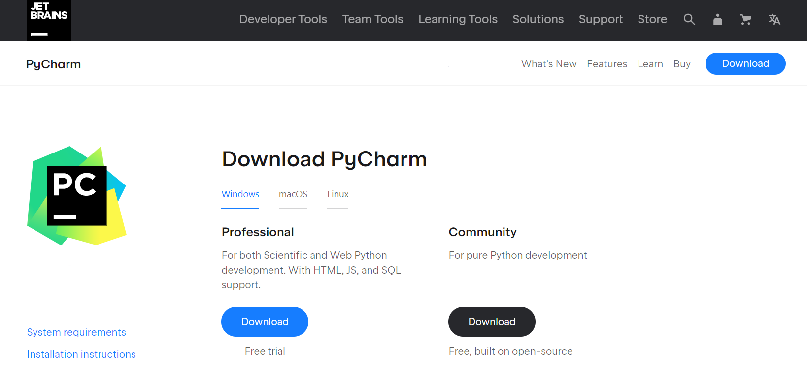
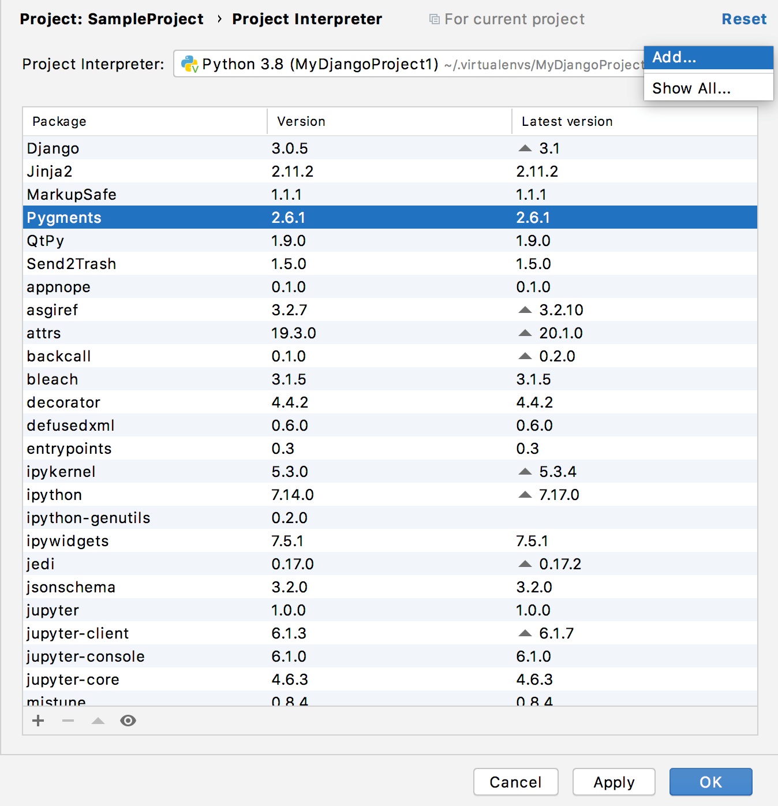
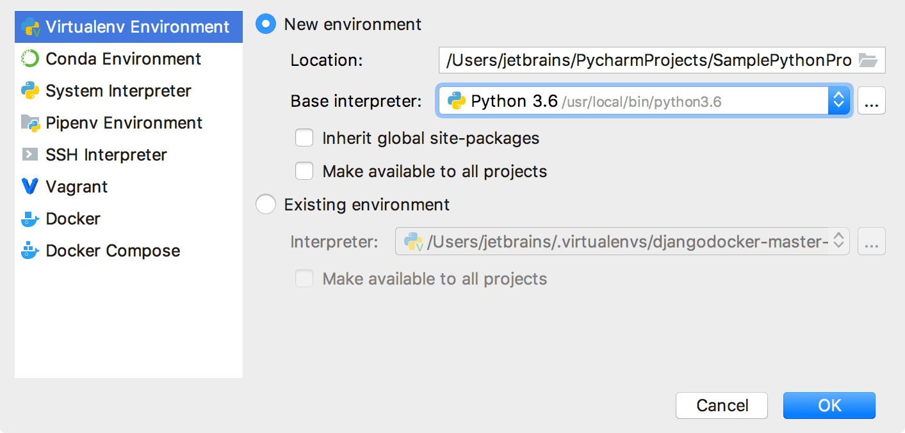
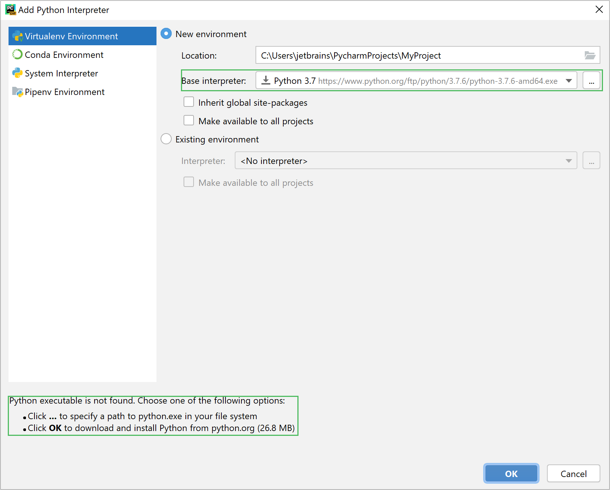
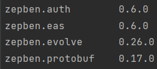

# How to use the Python SDK

The Evolve SDK provides the building blocks you need to interface with the rest of the platform. It can also be used to
build your own solutions from scratch that will be compatible with other things built with the SDK.

## First Steps

To be able to use the Python SDK, be sure to have the following:

1. Pycharm Installed in your machine.
2. Set up a virtual environment and add the Zepben Packages.
3. Start using the Zepben Evolve Python SDK

You can find a set-up guide below to meet the requirements.
__________

### 1. Download and set up Pycharm

PyCharm is one of the easiest integrated development environment (IDE) used for Python. As the 
SDK was developed using this programming language, we recommend using PyCharm to use the SDK.



PyCharm has the Community and the Professional version; the SDK will work on either version. You can download Pycharm 
[here](https://www.jetbrains.com/pycharm/download/#section=windows). 

**PyCharm has the following System Requirements:**

- 64-bit version of Microsoft Windows 10, 8.
- 2 GB RAM minimum, 8 GB RAM recommended.
- 2.5 GB hard disk space, SSD recommended.
- 1024x768 minimum screen resolution.
- Python 2.7, or Python 3.5 or newer.


**PyCharm has the following are the Installation Instructions:**

1. Run the pycharm-2021.3.2.exe file that starts the installation Wizard.
2. Follow all steps suggested by the wizard.
3. Launch PyCharm after installed.

-----------
## 2. Configure your Virtual Environment
### Create a virtual environment

1. After ensuring you have downloaded and installed [Python](https://www.python.org/downloads/) on your computer, 
do one of the following:

- Click the Python Interpreter selector and choose **Add Interpreter**.
- Press Ctrl+Alt+S to open the project **Settings/Preferences** and go to **Project <project name> | Python Interpreter**. Then click the setting icon and select **Add**.



2. In the left-hand pane of the Add **Python Interpreter** dialog, select **Virtualenv Environment**. The following actions depend on whether the virtual environment existed before.



If **New Environment** is selected:

1. Specify the location of the new virtual environment in the text field, or click `...` and find location in your file system. Note that the directory where the new virtual environment should be located, must be empty!
2. Choose the base interpreter from the list, or click `...` Choose the base interpreter and find a Python executable in the your file system.

If PyCharm detects no Python on your machine, it provides two options: to download the latest Python versions from python.org or to specify a path to the Python executable (in case of non-standard installation).



3. Select the **Inherit global site-packages** checkbox if you want that all packages installed in the global Python on your machine to be added to the virtual environment you're going to create. This checkbox corresponds to the `--system-site-packages` option of the [virtualenv](http://www.virtualenv.org/en/latest/index.html) tool.
4. Select the **Make available to all projects** checkbox if you want to reuse this environment when creating Python interpreters in PyCharm.
5. Click **OK** to complete the task.

If **Existing Environment** is selected:

1. Expand the **Interpreter** list and select any of the existing interpreters. Alternatively, click `...` and specify a path to the Python executable in your file system, for example, **C:\Python36\python.exe**.
2. Select the **Make available to all projects** checkbox if you want to reuse this environment when creating Python interpreters in PyCharm.
3. Click **OK** to complete the task.

For further information, take a look at JetBrains Documentation
on how to create a virtual environment [here](https://www.jetbrains.com/help/pycharm/creating-virtual-environment.html#existing-environment).

### Install the Zepben libraries

Use your terminal, making sure it is pointing at the virtual environment, to input the following command:

    pip install zepben.evolve

To check if the required Zepben Libraries where installed correctly, you can use the following command:

    pip list

Your terminal will show all the libraries installed in the virtual environment, including the Zepben libraries, similarly to the following snippet:



You can check the release history of the Zepben Evolve Python SDK [here](https://pypi.org/project/zepben.evolve/#history), to ensure that the latest
version  was installed correctly.

------------------

## 3. Start Using the Python SDK

### Configuration Setup

To run the evolve_sdk tutorial code, you need to pass a unique parameter with the path to the authentication config
file.

The authentication config file must follow this structure:

```
{
  "auth0": {
    "client_id": "your client_id",
    "username": "your_username@xxxx.com.au",
    "password": "Your password",
    "conf_address": "https://host_url/ewb/auth"
  },
  "ewb_server": {
    "host": "host_url",
    "port": 443,
    "rpc_port": 443,
    "secure": "True"
  },
  "eas_server": {
    "client_id": "instance_client_id",
    "host": "host_url",
    "port": 443
  }
}
```

The .json auth config file path must be passed as a unique parameter. Zepben can provide a pre-filled config file with auth0 credentials, EWB and EAS server configuration. To access this,
please make a request in Zepben's public [#evolve-dev](https://app.slack.com/client/T6M26EDT2/C01E8RZTBUG) Slack
channel.

## Using the Python SDK

### Creating Objects

The Evolve platform is composed around a domain model based on the 'Common Information Model' (CIM). The CIM is a very
large standard that covers a huge amount of use cases. To make things more digestible, Evolve publishes its
own [CIM profile](https://zepben.github.io/evolve/docs/cim/evolve/).

The following snippet of code showcases how to create Power Transformers, Energy Consumers, Photovoltaic Units and
Batteries:

    from zepben.evolve import PowerTransformer, EnergyConsumer, PhotoVoltaicUnit, BatteryUnit

    print('Creating objects...')
    # Create a Power Transformer
    power_transformer = PowerTransformer(mrid="pt1")
    print(power_transformer)

    # Create EnergyConsumer
    energy_consumer = EnergyConsumer(mrid="ec1")
    print(energy_consumer)

    # Create Photovoltaic Unit
    pv_unit = PhotoVoltaicUnit(mrid="pv1")
    print(pv_unit)

    # Create Battery
    battery = BatteryUnit(mrid="b1")
    print(battery)

### Connecting to a Server

It is also possible to interact, create or delete objects in a server. First, a connection with a set server must be
established. The following snippet showcases one way of establishing a connection with
the [EWB Server](https://zepben.github.io/evolve/docs/energy-workbench-server/2.8.0).

    from zepben.evolve import connect, SyncNetworkConsumerClient 

    print("Connecting to Server...")
    with connect(host=config['ewb_server']['host'], rpc_port=config['ewb_server']['rpc_port'],
                 conf_address=config['auth0']['conf_address'],
                 client_id=config['auth0']['client_id'],
                 username=config['auth0']['username'],
                 password=config['auth0']['password'], secure=True) as channel:
        client = SyncNetworkConsumerClient(channel)
        print("Connection Established")

### Query Data From a Server

Extracting and querying data from a specific Feeder can be accomplished by using the mrid of the desired feeder. The
next example displays the amount of Power Transformers, Energy Consumers, Photovoltaic Units and Batteries in the Feeder
CPM3B3:

    from zepben.evolve import connect, SyncNetworkConsumerClient, NetworkService, \
        PowerTransformer, EnergyConsumer, PhotoVoltaicUnit, BatteryUnit
    
    with connect(host=config['ewb_server']['host'], rpc_port=config['ewb_server']['rpc_port'],
                 conf_address=config['auth0']['conf_address'],
                 client_id=config['auth0']['client_id'],
                 username=config['auth0']['username'],
                 password=config['auth0']['password'], secure=True) as channel:
        client = SyncNetworkConsumerClient(channel)
    
        feeder_mrid=config['test_config']['feeder_mrid']
        result = client.get_equipment_container(mrid=feeder_mrid)
        container: NetworkService = client.service
    
    power_transformers: [PowerTransformer] = list(container.objects(PowerTransformer))
    energy_consumers: [EnergyConsumer] = list(container.objects(EnergyConsumer))
    pv_units: [PhotoVoltaicUnit] = list(container.objects(PhotoVoltaicUnit))
    batteries: [BatteryUnit] = list(container.objects(BatteryUnit))
    
    print(f'Power Transformers in the feeder {feeder_mrid}: {len(power_transformers)}')
    print(f'Energy Consumers in the feeder {feeder_mrid}: {len(energy_consumers)}')
    print(f'Photovoltaic Units in the feeder {feeder_mrid}: {len(pv_units)}')
    print(f'Batteries in the feeder {feeder_mrid}: {len(batteries)}')

### Creating and Uploading Studies

Creating and uploading studies to the server using a script is possible. The following example showcases the creation of
a very simple study. Once the study is created, it is automatically uploaded to the server and can be viewed in the
_Study List_ in the EAS Web Client.

    from geojson import Feature, Point, LineString, FeatureCollection
    from zepben.eas import Study, EasClient
    
    from utils.style_creator import CircleStyle, LineStyle, InterpolateColor, LinePaint, CirclePaint
    
    print('Uploading study to EAS Server...')
        eas_client = EasClient(host=config['eas_server']['host'], port=config['eas_server']['port'],
                               client_id=config['auth0']['client_id'],
                               username=config['auth0']['username'],
                               password=config['auth0']['password'])
    
        feature1 = Feature(id='id1', geometry=Point((144.408936254, -37.6999353628)))
        feature2 = Feature(id='id2', geometry=Point((144.408936254, -37.99353628)))
        feature3 = Feature(id='id3', geometry=LineString([(144.408936254, -37.99353628), (144.408936254, -37.6999353628)]),
                           properties={"number": "100"})
        fc1 = FeatureCollection([feature1, feature2, feature3])
        fc2 = FeatureCollection([feature3])
    
        styles = [CircleStyle(style_id='circle').style,
                  LineStyle(style_id='line').style,
                  LineStyle(style_id='line_loading', paint=LinePaint(
                      line_color=InterpolateColor(to_number_name="number", limits=[0, 50, 100]).color()).paint).style,
                  CircleStyle(style_id='circle2', paint=CirclePaint(color="red").paint).style]
    
        result1 = Study.Result(name='2 x Circle &  1 x Line',
                               geo_json_overlay=Study.Result.GeoJsonOverlay(data=fc1, styles=['circle', 'line']))
        result2 = Study.Result(name='1 x Line',
                               geo_json_overlay=Study.Result.GeoJsonOverlay(data=fc2, styles=['line_loading']))
    
        results = [result1, result2]
    
        study = Study(
            name='Basic Study',
            description='',
            tags=['basic_study'],
            results=results,
            styles=styles
        )
    
        eas_client.upload_study(study)
    
        print(f'https://{config["eas_server"]["host"]}')