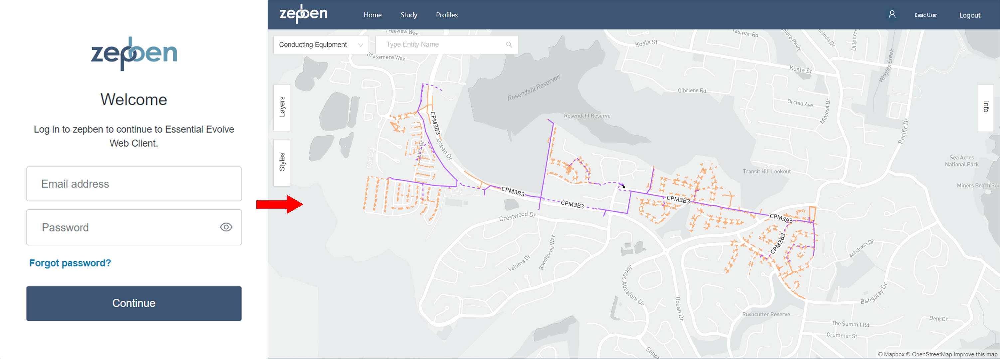
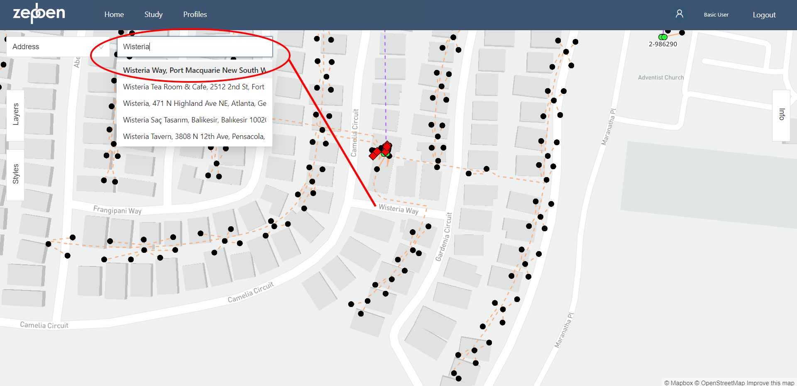
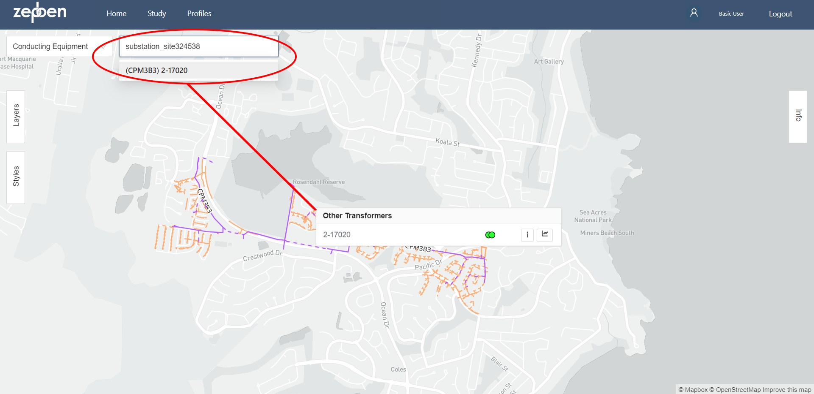
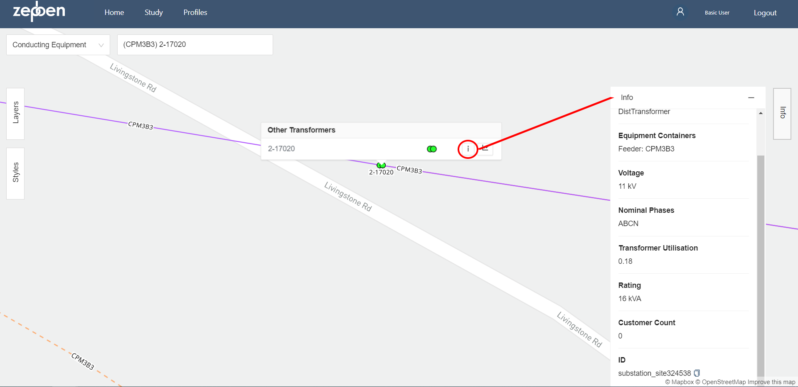
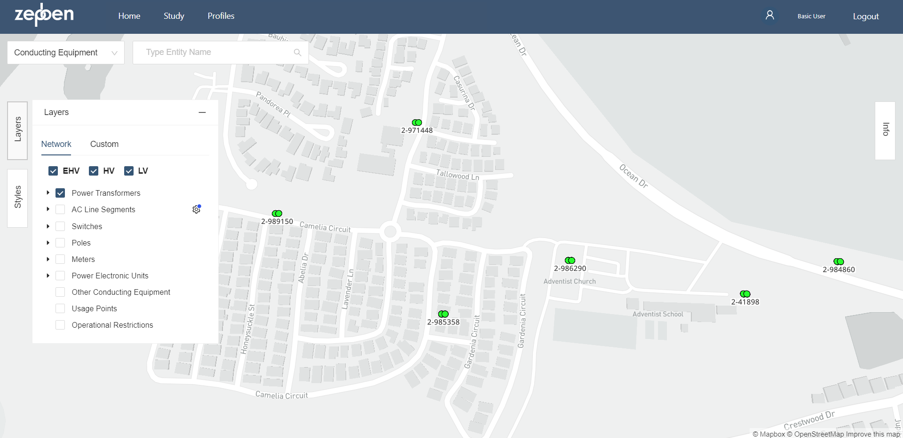
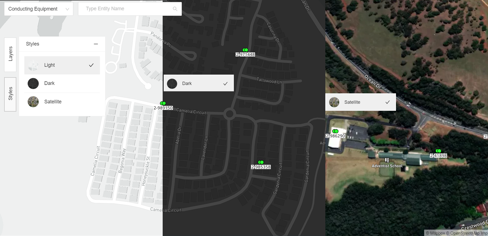
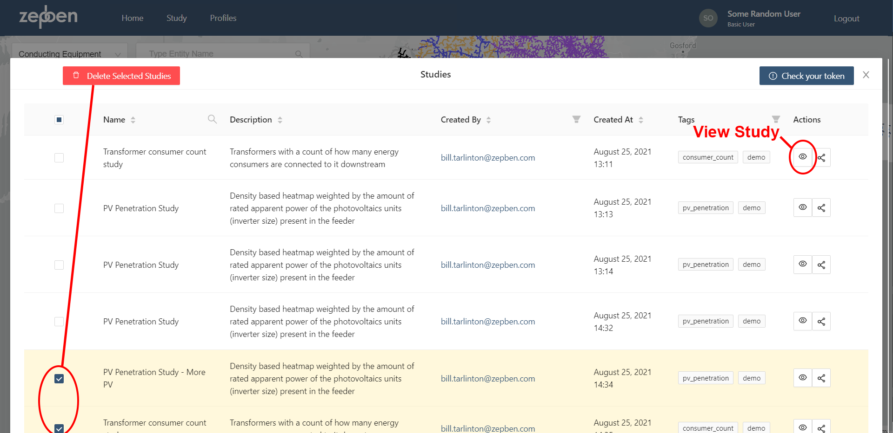
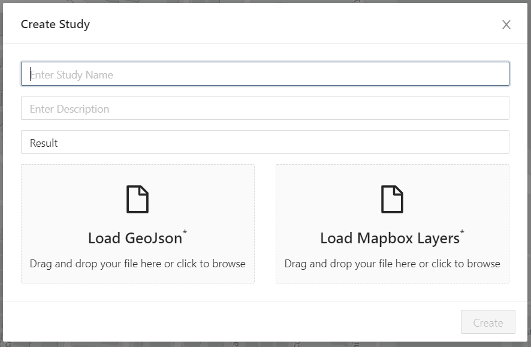

# Interacting with the EAS Web Client

The EAS Web Client provides a way for accessing Evolve App Server (EAS) functionality and features, including studies,
visualisations and trend analysis.

## Accessing the Essential EAS Web Client
Access the EAS Web Client, using the link: https://evolve.essential.zepben.com/

The Web Client will ask the user to log in, enter a username and the password. After signing in, users are able to access 
EAS, and it's functionalities.

> If you need an account please contact bill.tarlinton@zepben.com
## Features of the EAS Web Client

The EAS Web Client counts with multiple features that allows its users to have a more easy and intuitive navigation.
### Searching Address
Users are able to search for a specific address or location by typing it into the search box.

### Searching Equipment
Users are able to search for a specific Conducting Equipment by typing the ID into the search box.

### Equipment Information
Further information about the Conducting Equipment can be viewed by clicking on the information button:

### Using Layers
The EAS Web Client allows users to customize the visible data by using layers. The layers panel can be accessed by 
clicking on the "_Layer Button_" that is located at the left. For example, if a user wants to only see the Power 
Transformers in a specific are, they can accomplish this by adjusting the layers.

### Styles
Likewise, the user can customize the style of the map by clicking on the "_Style Button_" that is located at the left.

## Using and Creating Studies
The EAS Web Client allows users to create and view studies by clicking on the "_Study Button_" on the navigation menu.

### Accessing the Study List
By Selecting the option "_Studies_" in the "_Study Menu_" users are able to see all the existing  studies.
Users are able to view each studies by clicking the "_View Button_" under the Action colum on the right side of the table.
Users can also delete one or multiple studies by selecting them and clicking the "_Delete Selected Studies Button_" 

### Creating a Study
Users are able to create, upload and view their own studies. Studies can be uploaded manually or using a script.

#### Uploading a Study Manually
By CLicking on "_Studies_" on the Navigation Menu and then Selecting "_Create Study_". User will need to input a Study Name
and can Include a Study Description. Two files must be provided by the user, one being a GeoJson file and the other one 
being the style for the study.

Once the Study is created successfully, the New Study will appear in the Study List.